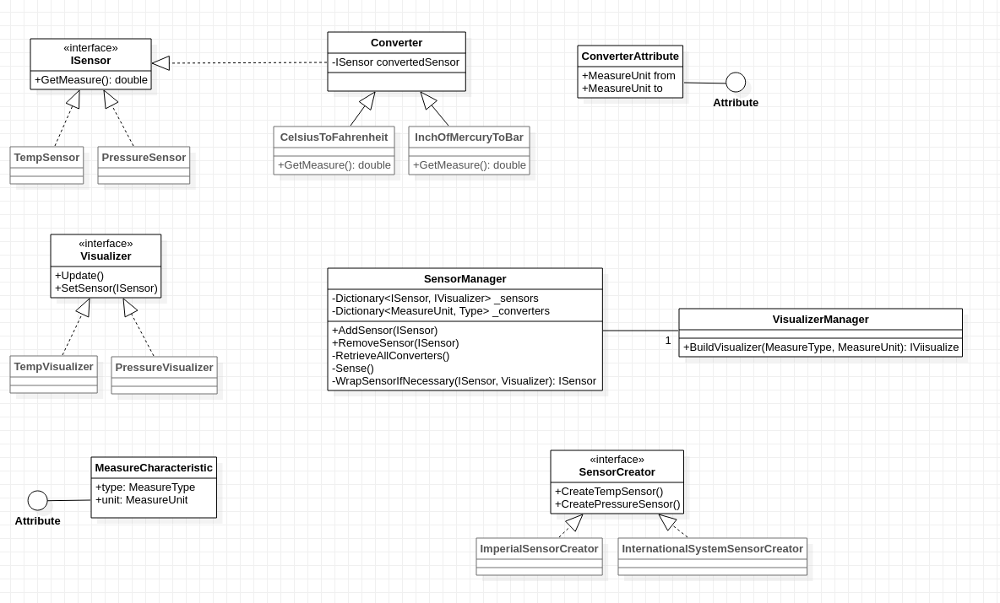

# TP Introspection

## JsonEncoder

Librairie : `JsonEncoder.dll`

Utilisation :
```csharp
Dictionnary<string, dynamic> result = MyJSON.Serialize(myObject);
```


## SmartHome

Librairie : `SmartHome.dll`

**Capteurs :** les capteurs implémentent l'interface `ISensor`.  
Des capteurs du système impérial et du système internationnal peuvent être créés par un client avec les factory `ImperialSensorCreator` et `CreatePressureSensor`. Ces factory ajoutent lors de la création des capteurs un attribut d'instance `MeasureCharacteristic` contenant les meta-données des capteurs : type et unité.  
Deux type de capteurs sont supportés jusqu'à présent : les capteurs de pression *(Hg ou Bar)* et de température *(°F ou °C)*.
*Note: les capteurs sont déclarés dans le fichier `Sensor.cs`*

**Afficheurs :** les afficheurs implémentent `IVisualizer`.  
Deux types d'afficheur sont disponibles : `TempVisualizer` et `PressureVisualizer`. Ces afficheurs possèdent un Attribut (cette fois-ci un Attribut statique lié à la classe, pas à l'instance) `MeasureCharacteristic` contenant les meta-données de l'afficheur : type et unité supportée.  
Les afficheurs sont créés par le gestionnaire des capteurs grâce à la classe `VisualizerManager` qui permet de construire un afficheur à partir de son type. Ce gestionnaire d'afficheur cherche automatiquement (grâce à l'introspection) un afficheur permettant d'afficher le type de donnée voulu.
*Note: les afficheurs sont déclarés dans le fichier `Visualizer.cs`*


**Convertisseur :** Les afficheurs construits grâce au `VisualizerManager` ne supportent pas forcement l'unité du capteur (en réalité, il n'y a que des afficheurs utilisant le système internationnal). Le gestionnaire des capteurs se chargera alors de wrapper le capteur dans un objet `Converter` qui sera du coup le nouveau capteur et qui se chargera de convertir l'unité d'un capteur en une nouvelle unité. Ces convertisseurs sont automatiquement cherchés par le gestionnaire des capteurs lors de sa création grâce à l'Attribut `ConverterAttribute` que possède les capteurs (unité d'entrée, unité de sortie).
*Note: les afficheurs sont déclarés dans le fichier `Converter.cs`*



Utilisation côté client :
```csharp
var sensorManager = new SensorsManager();
var imperialCreator = new ImperialSensorCreator();
var siCreator = new InternationalSystemSensorCreator();

sensorManager.AddSensor(imperialCreator.CreatePressureSensor());
sensorManager.AddSensor(siCreator.CreateTempSensor());
sensorManager.AddSensor(imperialCreator.CreateTempSensor());
```

Résulat :
```
Apply converter : SmartHome.InchOfMercuryToBar
Apply converter : SmartHome.CelsiusToFahrenheit
Pressure 0.3047748052827633 bar
Temp 87 °C
Temp 64.4 °C
Pressure 0.1015916017609211 bar
Temp 56 °C
Temp 41 °C
Pressure 0.13545546901456146 bar
```
